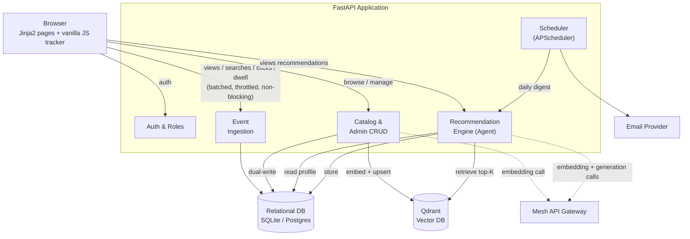

# SmartReco

**A Behavioral AI Recommendation Agent** — built for the *SmartReco Build Challenge 2026*, powered by **Mesh API**.

> **Status:** ✅ All 7 phases complete, including every committed bonus (LangGraph, APScheduler daily digest, LangSmith tracing, Qdrant metadata filtering). See the [Build Plan](#build-plan) for the phase-by-phase breakdown.

---

## What is SmartReco?

SmartReco is a course/product learning-marketplace web app that watches how each user actually behaves — what they view, what they search for, where they linger — and uses an **agentic RAG recommendation engine** to turn that behavior into personalized, persuasive recommendations grounded in a real product catalog.

It is deliberately **not** a static "related products" widget:

- A backend agent continuously accumulates each user's behavioral signals (views, searches, clicks, dwell time).
- It reasons over that profile, embeds a query, and retrieves the most relevant products from a **vector database** via semantic search (RAG) — recommendations are always grounded in the real catalog, never invented.
- It generates a short, persuasive narrative explaining *why* the recommendation fits this specific user, plus the specific recommended products.
- Recommendations are stored, shown on the site, and refresh as behavior evolves — and can optionally be pushed proactively as a scheduled email digest.

Every AI call (embeddings + chat generation) is routed through **Mesh API**, an OpenAI-compatible LLM gateway — this is the hackathon's mandatory, make-or-break requirement.

## Scope

| | |
|---|---|
| **In scope** | Email/password auth with two roles (user, admin); admin product management with dual-write to the relational DB *and* the vector DB, kept in sync; efficient non-blocking behavioral event tracking; an agentic RAG recommendation engine routed entirely through Mesh API; storage and display of refreshable recommendations; production-minded triggering and caching of AI calls. |
| **Bonus (committed)** | A structured **LangGraph** agent workflow; scheduled proactive email digests via **APScheduler**; end-to-end observability via **LangSmith**; retrieval polish via metadata filtering. |
| **Out of scope** | Payment processing, real course content delivery/streaming, multi-tenant organizations, mobile-native apps, social features. |

## Architecture

SmartReco is a **self-contained, monolithic** web application by design — a single FastAPI backend serves server-rendered pages, exposes JSON APIs for tracking/recommendations, owns the relational database, and coordinates with an external vector database and the Mesh API gateway. Fewer moving parts means faster solo delivery, an easy clone-and-run experience for reviewers, and fewer ways for a live demo to break.



### Request / behavior lifecycle

1. A user acts in the browser (views a course, searches, clicks, dwells).
2. The vanilla-JS tracker batches and throttles these events, POSTing them asynchronously without blocking the UI.
3. The Event Ingestion endpoint validates and stores events with who/what/when.
4. A trigger fires once the user crosses an event-count threshold (or requests a manual refresh).
5. The agent builds a behavioral profile, embeds a query via Mesh, and retrieves the top-K relevant products from Qdrant.
6. The agent sends the profile + retrieved candidates to a Mesh chat model, which generates a persuasive narrative plus specific recommendations.
7. The recommendation is stored and shown on the site, refreshing as behavior continues to evolve.

## Tech Stack

| Layer | Choice | Why |
|---|---|---|
| Package manager | **uv** | Fast, reproducible dependency resolution and locking. |
| Backend | **FastAPI** + Uvicorn | Async, typed, Pydantic-native; serves both templates and JSON APIs. |
| Frontend | **Jinja2** + vanilla JS | Minimal moving parts; tracking is pure JS regardless of framework. |
| LLM access | **openai SDK → Mesh API** | Mandatory Mesh routing, behind a swappable wrapper. |
| Vector DB | **Qdrant** | Strong metadata filtering; local Docker for dev, Cloud free tier for deploy. |
| Relational DB | **SQLite → Postgres** | Zero-config for dev/demo; Postgres-ready via a single `DATABASE_URL` change. |
| ORM | **SQLModel** | SQLAlchemy + Pydantic in one model (FastAPI author); one class is both ORM table and schema; still SQLite → Postgres via `DATABASE_URL`. |
| Agent (bonus) | **LangGraph** | Explicit reasoning graph: analyze → retrieve → evaluate → refine → generate. |
| Scheduling (bonus) | **APScheduler** | In-process daily digest job — no extra broker needed for a solo build. |
| Observability (bonus) | **LangSmith** | End-to-end tracing of the agent workflow. |
| Auth | Session + password hash | Email/password with bcrypt hashing; two roles. |

## Mesh API Compliance

Routing every AI call through Mesh API is the single make-or-break rule of this hackathon. SmartReco makes exactly two kinds of AI calls, both via the official `openai` SDK pointed at Mesh's base URL:

```python
from openai import OpenAI

client = OpenAI(
    base_url="https://api.meshapi.ai/v1",
    api_key=settings.MESH_API_KEY,   # loaded from .env, never committed
)

# Embedding (for Qdrant)
client.embeddings.create(model=EMBED_MODEL, input=texts)

# Persuasive generation
client.chat.completions.create(model=CHAT_MODEL, messages=[...])
```

| AI operation | Purpose | Mesh endpoint |
|---|---|---|
| Embeddings | Convert product text and behavioral query text into vectors for Qdrant semantic search. | `POST /v1/embeddings` |
| Chat completion | Generate the persuasive recommendation narrative grounded in retrieved products. | `POST /v1/chat/completions` |

All Mesh calls are wrapped in a single internal `LLMClient` — agent logic never calls the SDK directly, keeping Mesh usage centralized, auditable, and easy to verify.

## Data Model

**Relational schema** (SQLModel, SQLite → Postgres):

- **users** — `id`, `email` (unique), `password_hash` (bcrypt), `role` (`user`/`admin`), `created_at`
- **products** — `id` (also the Qdrant point ID), `title`, `description`, `category`, `price`, `created_at`/`updated_at`
- **events** — `id`, `user_id` FK, `event_type` (`view`/`search`/`click`/`dwell`), `product_id` FK (nullable), `event_metadata` (JSON — named `event_metadata` rather than `metadata`, which is a reserved attribute on SQLAlchemy declarative models), `created_at`
- **recommendations** — `id`, `user_id` FK, `narrative`, `product_ids` (JSON, ordered), `trigger_reason` (`threshold`/`manual`), `created_at`

**Vector store (Qdrant):** collection `products`, one point per catalog item, point ID = relational `product.id`, vector = embedding of title + description, payload = `title`/`category`/`price` for metadata-filtered retrieval.

## Functional Requirements Summary

| ID | Area | Summary |
|---|---|---|
| FR-1 | Auth & Roles | Email/password auth, bcrypt hashes, two roles (user/admin), session-based login. |
| FR-2 | Catalog & Dual-Write | Admin CRUD on products; every create/edit/delete dual-writes to SQL *and* Qdrant transactionally so the stores never drift. |
| FR-3 | Behavioral Tracking | Non-blocking, batched/throttled tracking of views, searches, clicks, dwell time. |
| FR-4 | Agentic Recommendations | Behavioral profile → RAG retrieval from Qdrant → persuasive, catalog-grounded narrative. *(Bonus: explicit LangGraph graph.)* |
| FR-5 | Triggering & Caching | Hybrid trigger (event-count threshold + manual refresh); cached recommendations served when behavior hasn't meaningfully changed. |
| FR-6 | Scheduled Delivery *(bonus)* | APScheduler daily email digest, reusing the same agent pipeline. |
| FR-7 | Observability *(bonus)* | LangSmith tracing across the agent's analyze/retrieve/evaluate/generate steps. |

## Dataset & Catalog Scope

The catalog is seeded from a **public, CC0-1.0 (public domain) Udemy course dataset**, committed to the repo at [`scripts/data/courses.csv`](scripts/data/courses.csv). It's a combination of 5 companion datasets published by Kaggle user `jilkothari` — [Finance & Accounting](https://www.kaggle.com/datasets/jilkothari/finance-accounting-courses-udemy-13k-course), [Business](https://www.kaggle.com/datasets/jilkothari/business-courses-udemy-10k-courses), [IT & Software](https://www.kaggle.com/datasets/jilkothari/it-software-courses-udemy-22k-courses), [Development](https://www.kaggle.com/datasets/jilkothari/udemy-courses-development), and [Lifestyle](https://www.kaggle.com/datasets/jilkothari/lifestyle-courses-udemy-39k-course) — sampled 1,000 rows/category, deduplicated by title, and interleaved round-robin across categories (5,000 rows total). This replaces the SRS's originally-named sources: both were checked via the Kaggle API and came back with an unconfirmed/unspecified license, unsuitable for a public repo — this CC0-1.0 family is cleanly licensed *and* gives better category diversity (5 real categories) for demonstrating behavioral clustering.

The committed 5,000-row file is deliberately larger than the working set: `CATALOG_LIMIT` (default **1,500**, per the SRS's 1,000–2,000 working-set range) takes a prefix of it at seed time. Because the file is category-interleaved, any prefix length stays balanced across categories — lifting the limit later needs no code or data change.

The source data has no `description` field (title, price, rating, review/subscriber counts only) — `seed_catalog.py` synthesizes a short description from those real fields rather than embedding a bare title. See `docs/BUILD_PLAN.md` Phase 2 for the full provenance and licensing trail.

Seeding (`scripts/seed_catalog.py`) batches embeddings (~100 inputs per Mesh call — 1,500 products seeds in 15 Mesh calls), is resumable/idempotent (skips titles already in the database), and uses light retry/backoff on rate limits.

## Project Structure

```
smartreco/
  app/
    main.py                    # FastAPI app factory, lifespan (init_db, scheduler), routers
    config.py                  # pydantic-settings; reads .env
    db.py                      # SQLModel engine/session (SQLAlchemy under the hood)
    scheduler.py                # APScheduler daily digest job (BackgroundScheduler)
    observability.py            # LangSmith tracing env-var wiring for the LangGraph pipeline
    models/                     # SQLModel tables
      user.py                     # users (email, password_hash, role)
      product.py                  # products (catalog items, also the Qdrant point ID)
      event.py                    # events (behavioral tracking)
      recommendation.py           # recommendations (narrative, product_ids, trigger_reason)
    routers/                    # request handling — auth, catalog, admin, events, pages, recommendations
    services/
      auth.py                     # password hashing, session dependencies, safe_next_path
      catalog.py                   # dual-write orchestration (SQL + Qdrant, rollback on failure)
      llm_client.py                 # thin Mesh wrapper (openai SDK) — the only place that calls Mesh
      embeddings.py                  # batched Mesh embeddings helper, retry/backoff
      vector_store.py                 # Qdrant client, collection setup, top-K + metadata-filtered search
      email.py                         # SMTP send (or log-fallback if unconfigured)
      digest.py                         # daily digest job logic — runs the graph per active user, emails it
      ui.py                              # deterministic tonal product-cover generator (no product images)
    agent/
      graph.py                  # LangGraph workflow: analyze -> retrieve -> evaluate -> refine -> generate
      nodes.py                   # the same pipeline's building blocks + the streaming first-generation path
      triggers.py                 # event-threshold auto-regeneration logic
    templates/                  # Jinja2 pages (auth, catalog, admin, recommendations)
    static/
      css/style.css                # the whole design system (tokens, components, light/dark)
      js/tracker.js                 # non-blocking, batched/throttled behavioral tracker
      js/recommendations-stream.js   # SSE client for the streaming narrative
      js/password-toggle.js           # login/register password show/hide toggle
  scripts/
    mesh_spike.py               # Phase 0 connectivity check (throwaway)
    seed_catalog.py              # load scripts/data/courses.csv -> SQLite + Qdrant
    create_admin.py               # interactive admin bootstrap (make create-admin)
    data/courses.csv               # committed, CC0-1.0 seed dataset
  tests/                       # pytest, mocks Mesh/Qdrant, isolated in-memory DB
  docs/
    SmartReco_SRS.docx          # source of truth for requirements
    BUILD_PLAN.md                 # mandatory phase-by-phase execution plan
    DESIGN.md                      # design system tokens (colors, type, spacing)
  .github/workflows/smartreco-checks.yml
  docker-compose.yml / docker-compose.override.yml   # app + Qdrant + MailHog (dev)
  Dockerfile / docker-entrypoint.sh
  Makefile
  pyproject.toml / uv.lock
  .env.example
  .gitignore
  README.md
```

## Getting Started

**Prerequisites:**
- Docker + `make`
- A valid Mesh API key (prefixed `rsk_`)

**`make` + Docker Compose is the only supported way to run the project** — it keeps the app and Qdrant on identical config (SQLite path, `QDRANT_URL`) with no local/container drift to reason about.

```bash
cp .env.example .env       # then fill in MESH_API_KEY
make up-build               # builds the app image, then starts app + Qdrant
make seed                   # seeds ~1,500 products into SQLite + Qdrant (run once the stack is up)
make create-admin           # interactively create an admin account (email + password + confirm)
```

Anyone can self-register a regular user via `/register` in the UI. There's no admin option there by design — creating an admin only happens via `make create-admin`, so privilege escalation can't happen through the public signup form. The command is idempotent: run it again with an email that's already a regular user and it promotes that account to admin instead of erroring.

- App: http://localhost:8000 — register an account, browse/search the catalog at `/catalog`, and (as an admin) manage products at `/admin/products`.
- Qdrant dashboard: http://localhost:6333/dashboard
- MailHog (local SMTP catcher for the daily digest bonus — see below): http://localhost:8025

After the first `make up-build`, plain `make up` is enough unless dependencies or the Dockerfile changed. `make down` to stop, `make logs` to tail output, `make ps` for status.

**Bonus features (all optional, all off by default):**
- **Daily email digest** (APScheduler + SMTP): with no `.env` setup, the scheduled job logs the rendered digest instead of sending. To see a real email locally, set `SMTP_HOST=mailhog` and `SMTP_PORT=1025` in `.env` (`SMTP_USER`/`SMTP_PASSWORD` stay blank — MailHog needs no auth) — `make up`/`make up-build` already starts a MailHog container for this, and delivered mail shows up at http://localhost:8025. For a real relay (e.g. Gmail), set `SMTP_HOST` to it and fill in `SMTP_USER`/`SMTP_PASSWORD`.
- **LangSmith tracing**: set `LANGCHAIN_TRACING_V2=true` and `LANGCHAIN_API_KEY` in `.env` to trace every LangGraph run (the manual "Refresh Recommendations" pipeline) to your LangSmith dashboard. `LANGCHAIN_PROJECT` optionally targets a specific project (defaults to `smartreco`).

**Hot reload:** `make up`/`make up-build` auto-merge `docker-compose.override.yml`, which bind-mounts `app/` and `scripts/` into the container and runs uvicorn with `--reload` — edit a router, template, or `static/css` file on the host and the running app picks it up immediately, no rebuild needed. This override is dev-only; it's never used in production.

**Production:** `make prod-build` / `make prod-up` / `make prod-down` run Compose with `-f docker-compose.yml` explicitly, excluding the dev override — no bind mounts, no `--reload`, the container runs the exact image that was built, with healthchecks and a `restart: unless-stopped` policy. The same `docker-compose.yml` is what you'd point a production host or CI/CD pipeline at.

**Dev tooling** (needs [`uv`](https://github.com/astral-sh/uv) locally — tests run against an isolated in-memory DB with Mesh/Qdrant mocked, independent of the running stack):

```bash
make install   # uv sync - needed once, for the commands below
make test      # uv run pytest
make lint      # uv run ruff check app scripts tests
make fmt       # uv run ruff format app scripts tests
```

Run `make help` for the full list of available commands.

Required environment variables include `MESH_API_KEY` (mandatory for every AI call) and `DATABASE_URL` (defaults to a local SQLite file; swap to Postgres for production). Secrets are never committed — `.env` is gitignored.

## Build Plan

Sequenced to de-risk the make-or-break item (Mesh) first, then the grounded pipeline, then bonuses. Each phase is independently runnable and does not depend on any later phase, so they execute strictly in order.

| Phase | Deliverable | Status |
|---|---|---|
| 0 — Mesh spike | Minimal script: one embedding + one chat call through Mesh. | ✅ |
| 1 — Foundation | FastAPI app (uv), SQLModel models, auth + roles, Jinja2 shell. | ✅ |
| 2 — Catalog + dual-write | Admin CRUD; seed script; products dual-written to SQLite + Qdrant. | ✅ |
| 3 — Tracking | Vanilla-JS batched/throttled tracker; non-blocking ingestion. | ✅ |
| 4 — Agent (core) | Profile → Mesh embed → Qdrant retrieve → Mesh generate → store → display. | ✅ |
| 5 — Triggers + cache | Hybrid event-threshold + manual refresh; caching to avoid redundant LLM calls. | ✅ |
| 6 — Bonuses | LangGraph agent graph; APScheduler daily digest; LangSmith tracing; metadata filtering. | ✅ |
| 7 — Polish + submit | README, `.env.example`, CI workflow + secrets, final codebase review; optional deploy + demo video. | ✅ |

See [`docs/BUILD_PLAN.md`](docs/BUILD_PLAN.md) for the full phase-by-phase breakdown — concrete tasks, decisions made on the SRS's open questions (event-trigger threshold, email digest provider, dataset/catalog-limit choice, session strategy), and a definition-of-done for each phase.

## Submission & CI Compliance

This is a hackathon submission judged automatically and by human reviewers. Required at submission time:

- All source code, plus `pyproject.toml` listing `fastapi` (web framework) and `openai` (the LLM client used through Mesh) — no separate `requirements.txt`, since `pyproject.toml` already satisfies the "requirements.txt *or* pyproject.toml/Pipfile" requirement and the CI screener reads it directly.
- `.gitignore` that excludes `.env` — no secrets ever committed.
- GitHub repository secrets: `MESH_API_KEY` and `SUBMISSION_TOKEN`.
- The mandated CI workflow file (`.github/workflows/smartreco-checks.yml`), downloaded **only** from the official hackathon dashboard — not from any third-party source.

## Reference Documents

- [`docs/SmartReco_SRS.docx`](docs/SmartReco_SRS.docx) — full Software Requirements Specification (v1.0, draft).
- Mesh API docs: [developers.meshapi.ai](https://developers.meshapi.ai)
